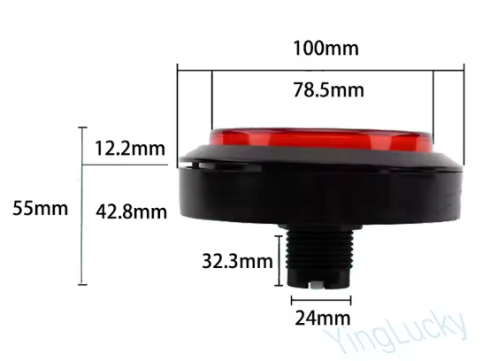
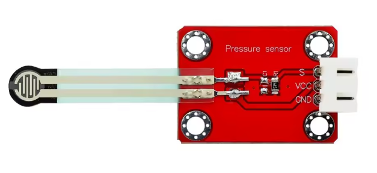
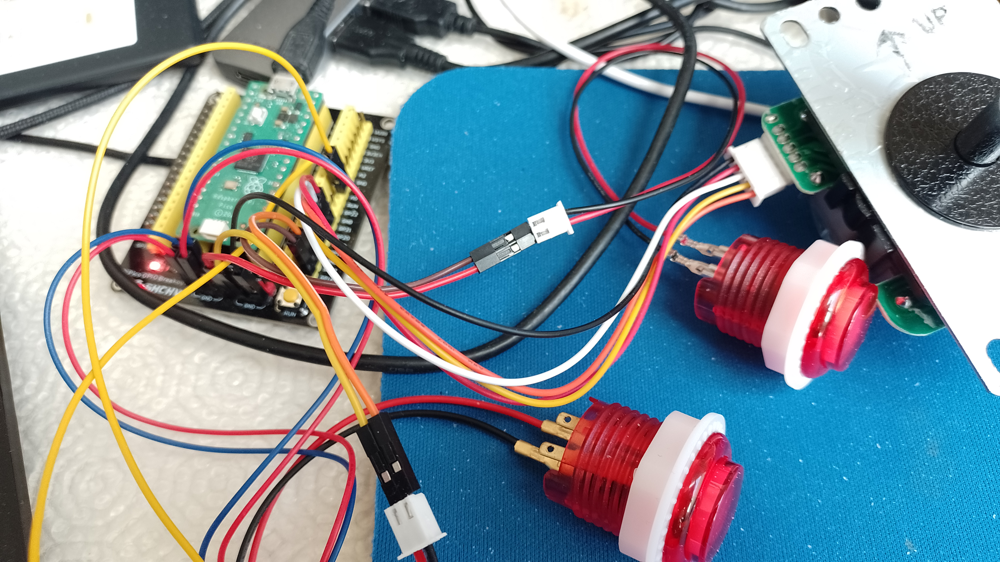
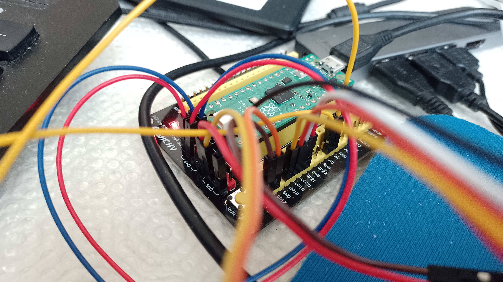
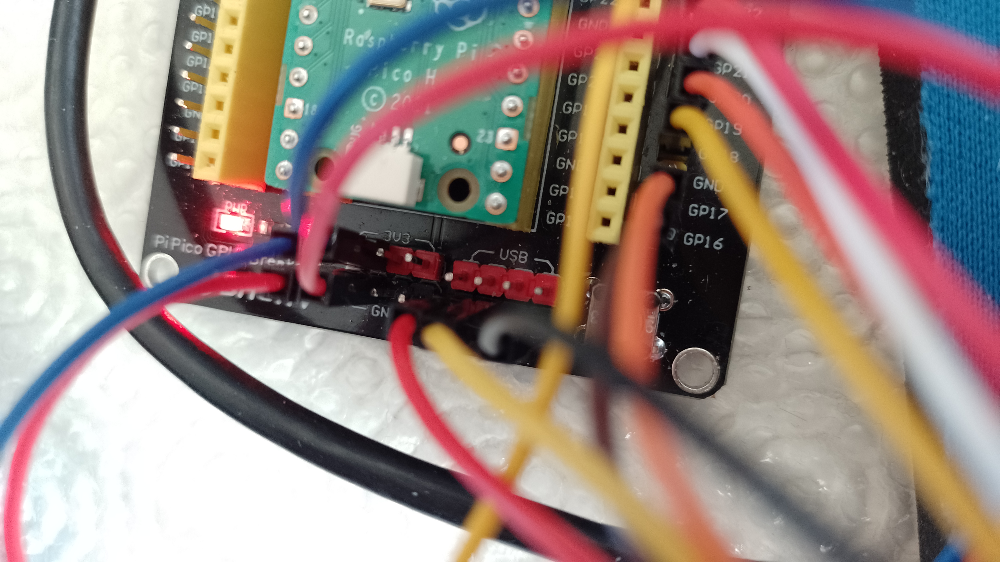
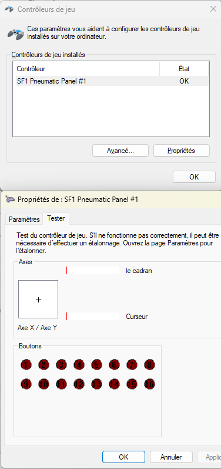
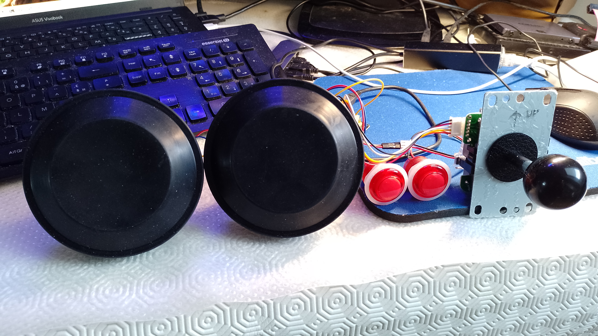

# 🥊 SF1 Pneumatic Panel – DIY FSR Version (Raspberry Pi Pico)

## Philosophy

This project is built around a simple idea:

Recreate the feeling of the original Street Fighter 1 pneumatic pressure buttons  
without compressors, without fragile air systems, and without rare proprietary parts.

Instead of chasing original hardware, this project embraces a true DIY mindset:

- Use accessible components  
- Repurpose off-the-shelf parts  
- Keep everything understandable  
- Keep everything repairable  
- Keep everything reproducible  

No custom PCB.  
No hidden electronics.  
No exotic components.

Just a Raspberry Pi Pico, two FSR sensors, clever mechanical adaptation,  
and respect for arcade history.

This is not a museum replica.  
It is a modern, clean, reproducible reinterpretation.

---

# 🎮 Target Game

- Game: Street Fighter 1  
- ROM: `sfjan`  
- Emulator: `mame64`  

Goal: reproduce the analog punch/kick intensity system using pressure sensors.

---

# 🧰 Hardware Used

## 🧠 Controller

- Raspberry Pi Pico  
- CircuitPython 9.x  
- USB HID Joystick mode  

---

## 🥊 Large Arcade Button

Used as pressure surface:

- Total diameter: 100 mm  
- Inner visible diameter: 78.5 mm  
- Thread diameter: 24 mm  
- Total height: 55 mm  

The button is NOT used as a digital switch.  
It becomes a mechanical pressure actuator.

---

## 🧩 Rubber Dome (DIY Key Element)

A 100mm inner diameter automotive headlight dust cover  
(rubber sealing cap for car bulb housing) is used.

It perfectly fits over the large arcade button.

This rubber dome:

- Distributes pressure evenly  
- Protects the FSR  
- Creates progressive compression  
- Simulates pneumatic resistance  

Search reference:

Car headlight bulb dust cover – 100mm internal diameter

---

## 🔧 Mechanical Modification (Important)

The original microswitch is NOT used electrically.

To prevent accidental activation:

- Cut part of the internal plastic of the button plunger  
- Ensure it does NOT press the original microswitch  
- Keep the switch body only as mechanical support  

The microswitch becomes structural only.

---

## 📏 FSR Sensors

- 2 × FSR modules with breakout board (VCC / GND / S)  
- Analog output  
- Powered at 3.3V  

Mounting:

- FSR placed under the plunger  
- Thin foam between plunger and FSR  
- No preload at rest  

If an axis moves without pressing → FSR is too compressed.

---

# 🔌 Wiring

## 🥊 FSR Sensors

Punch FSR  
- Signal → GP26 (A0)  
- VCC → 3V3  
- GND → GND  

Kick FSR  
- Signal → GP27 (A1)  
- VCC → 3V3  
- GND → GND  

⚠ Use 3.3V only (never 5V).

---

## 🎮 Joystick

- UP → GP18  
- DOWN → GP19  
- LEFT → GP20  
- RIGHT → GP21  
- Common → GND  

Internal pull-ups enabled.  
Pressed = connected to GND.

---

## 🔘 System Buttons

- START → GP16  
- SELECT / HOTKEY → GP17  
- Common → GND  

---

# 🔧 Electronics Setup

Raspberry Pi Pico connected via Dupont wires  
to FSR breakout boards, joystick, and buttons.

---

# 🎛 Windows Axis Mapping

Open: Win + R → joy.cpl  

Device name:  
SF1 Pneumatic Panel #1  

Windows shows:

- Dial → A0 (GP26) → Punch  
- Slider → A1 (GP27) → Kick  

Axes start at minimum and increase with pressure.  
They are NOT centered. This is normal for SF1.

---

# 🖥 Full Panel Prototype

Current setup includes:

- 2 pressure domes  
- Joystick  
- Start / Select buttons  
- USB-powered Pico  

---

# 👆 Pressure Demonstration

Progressive compression.  
Analog response.  
No air system required.

---

# 💾 CircuitPython Installation

## Install CircuitPython

1. Hold BOOTSEL  
2. Plug Pico into USB  
3. Copy CircuitPython `.uf2` file  
4. Pico reboots and appears as a USB drive  

## Copy Files

Copy the following files to the Pico:

- boot.py  
- code.py  

boot.py enables USB HID joystick mode.  
code.py reads FSR, joystick and buttons and sends USB data to the PC.

---

# 🎮 MAME Configuration (sfjan)

Copy `sfjan.cfg` into:
mame/cfg/
or
if RetroBat : "RetroBat folder"\saves\mame\ctrlr

Inside the game:

Adjust:

TAB → Analog Input Adjustments

Recommended values:

- Sensitivity: 100  
- Reverse: Off  
- Auto-centering Speed: 50  
- Increment Speed: 25  

---

# 🧠 How It Works

1. FSR reads pressure on A0 and A1  
2. CircuitPython converts analog values  
3. Pico exposes USB HID joystick  
4. MAME interprets axis movement as punch/kick intensity  
